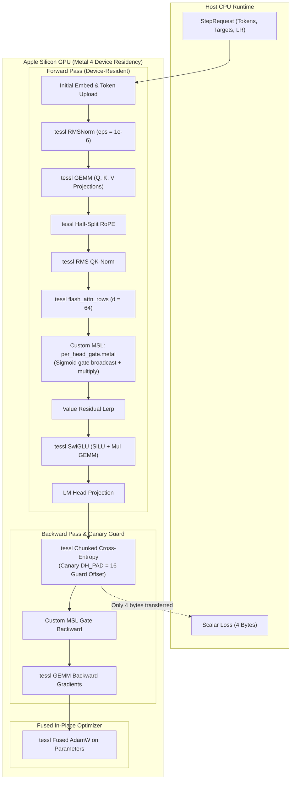
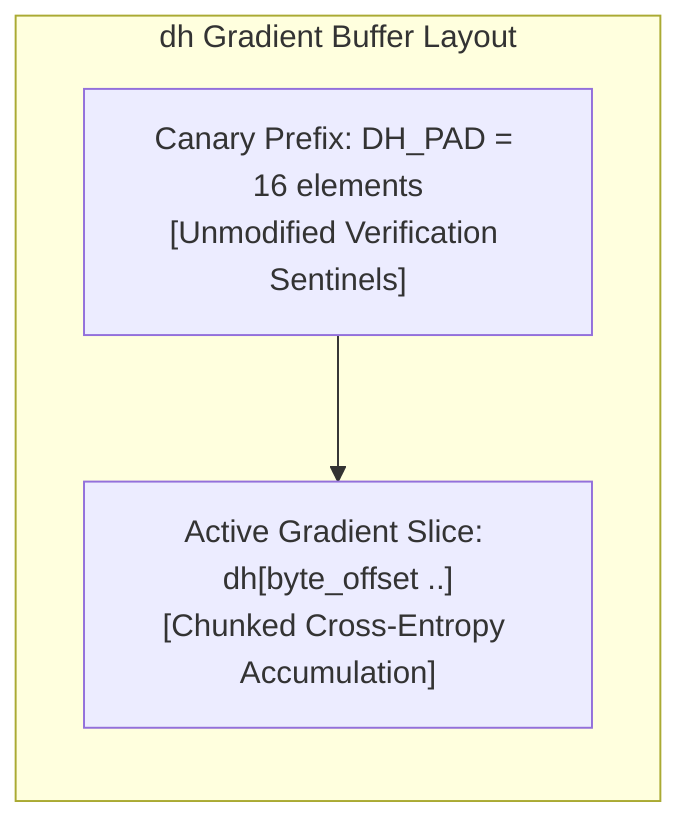

# ojas-metal

`ojas-metal` provides the native Apple Silicon GPU backend for **ojas**, executing the full deep learning training pipeline and inference directly on Apple M-series chips via **Metal 4**.

It bridges high-throughput GEMM, normalization, and flash-attention kernels from `tessl` with custom MSL (Metal Shading Language) shaders for attention output gating.

---

## Metal Execution & Memory Residency

Tensors remain device-resident across the entire forward, backward, and optimizer cycle, reading back only the final scalar loss (4 bytes) or greedy logits (8 bytes) to host memory:

---

## Hardware Shaders & Custom MSL

### 1. Per-Head Attention Gate (`kernels/per_head_gate.metal`)
Nanolab default GPT applies a linear gate with bias followed by sigmoid modulation to scale attention heads. `ojas-metal` implements dedicated Metal shaders:
* **Forward Kernel:** Computes $g = \sigma(x W_g + b_g)$ and evaluates $y = \text{attn} \odot g$.
* **Backward Kernel:** Computes analytic adjoint gradients $\frac{\partial \mathcal{L}}{\partial \text{attn}}$ and $\frac{\partial \mathcal{L}}{\partial W_g}$ on the device.

### 2. Backend Extension Shaders (`kernels/ojas_backend.metal`)
Implements elementwise operations, vector arithmetic, and reduction passes required by `ojas_core::Backend`, plus:
* **`permute`** (`ojas_permute`): a device-resident, bit-exact axis reorder up to rank 8, such as `[B, T, H, D]` to `[B, H, T, D]`. A NaN or infinity in the input is refused, as on the CPU reference.
* **AdamW** (`ojas_adamw_check`, `ojas_adamw_apply`): torch's single-tensor step in tessl's f32 arithmetic, with scalars from `ojas_core::check_adamw`. The step is in place and needs no scratch.
  * The check kernel decides the whole step: inputs and every new p, m and v must be finite.
  * The apply kernel, in the same command buffer, writes only if no status word is set. A refused step leaves all three tensors bit-identical.
  * One wait per call, and no copies.
* **RMSNorm** (`ojas_rms_fwd`, `ojas_rms_bwd_rows`, `ojas_rms_bwd_w_{part,sum}`): one simdgroup per row.
  * The weight gradient is a two-stage, fixed-order reduction (64-row partials, then a sum per column), so it is deterministic.
* **Cross-entropy** (`ojas_ce_fused`): two passes per row (an online max/sum, then the gradient) instead of five.
  * The input and output finiteness checks are folded into those passes. Every element is still checked, including rows whose target is ignored.
* **Causal attention** (`ojas_attn_fwd_d*` and `ojas_attn_bwd_{stats,dq,dkv}_d*`, at head dims 16, 32, 64 and 128): FlashAttention-2 on the TensorOps matrix units (MetalPerformancePrimitives `matmul2d`), after tessl's `qwen35_attn_tiled.metal` and `qwen35_attn_bwd.metal`.
  * The forward is one dispatch with an online softmax. The backward is three dispatches.
  * Each threadgroup rebuilds 32 x 32 score blocks in about 8 KiB of threadgroup memory, so nothing T x T is stored.
  * Every output row is written once with no atomics, so results repeat bit for bit.
  * A `[T, D]` plane must fit i32 extents.

---

## Cross-Entropy Canary Offset Defense

> [!CAUTION]
> Legacy Metal implementations frequently overwrite memory preceding a buffer slice because internal kernels forcibly assume an offset of zero (`Cols::dense`). 
> 
> `ojas-metal` reserves `DH_PAD = 16` padding elements before the `dh` slice and rigorously verifies in test `ce_nonzero_dh_offset_keeps_prefix` that the leading prefix remains bit-identical after cross-entropy writes.

---

## Key Invariants & Refusal Policies

> [!IMPORTANT]
> 1. **Strict Head Dimension Refusal:** `MetalBackend` refuses $d_{\text{head}} > 64$ (`ojas_core::METAL_MAX_HEAD_DIM`) with `Err(OjasError::UnsupportedHeadDim)`—never silently clamping or dropping high-index features. The attention kernels are compiled up to 128 and tested there below the trait, so raising the core limit to 128 is the only change needed to admit it.
> 2. **AdamW Step Counter Safety:** Step increments use checked integer math. When `step` reaches `u64::MAX`, the kernel halts with an error instead of wrapping to zero.
> 3. **Device Residency Invariant:** No intermediate activations or gradients are downloaded to the host during `Step`. Only the 4-byte scalar loss is read back.
