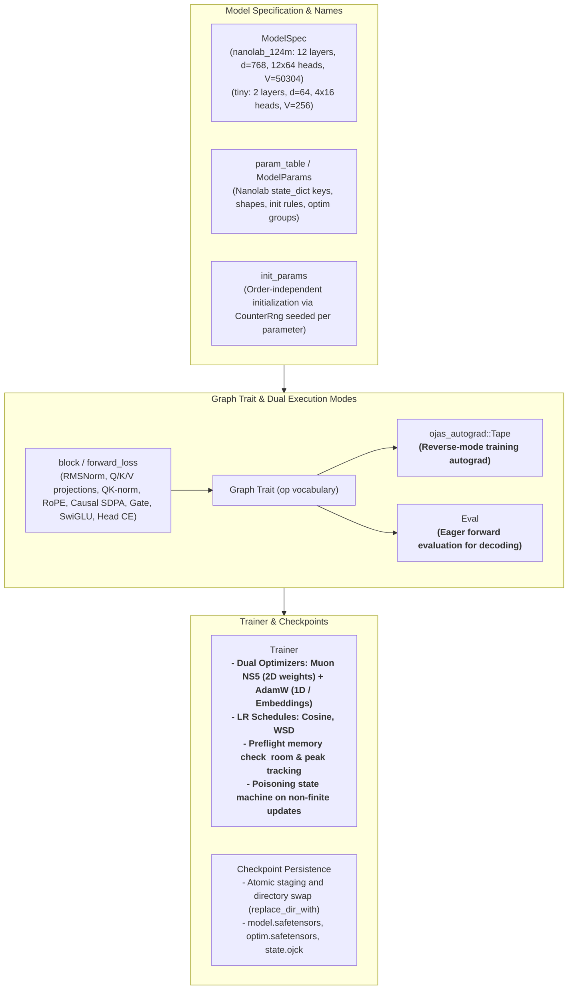

# ojas-model

`ojas-model` defines the **nanolab default GPT** model architecture, order-independent parameter initialization, execution graph abstractions, dual-optimizer device trainer, and checkpoint persistence.

It depends on `ojas-core`, `ojas-autograd`, `ojas-io`, and `ojas-data` (`#![forbid(unsafe_code)]`).

---

## Architecture & Subsystems

---

## Model Specification & Parameters

The default model follows the nanolab GPT-2 architecture:
* **Layers:** 12 transformer blocks.
* **Hidden Dimension:** $d_{\text{model}} = 768$.
* **Attention Heads:** 12 heads, each with $d_{\text{head}} = 64$.
* **MLP:** SwiGLU with intermediate width 2,048.
* **Vocabulary:** 50,304 tokens, tied embedding and language modeling head.
* **Attention Features:** Per-head output gating and value-residual blending.
* **Norms:** RMSNorm ($\varepsilon = 10^{-6}$) with per-head QK-norm before RoPE.

### Parameter Initialization & Groups

Parameters are drawn deterministically from a `CounterRng` seeded with `seed ^ fnv1a(name)` using Box-Muller, ensuring initialization is independent of iteration or parameter collection order.

| Parameter Name | Shape | Init Distribution | Optimizer Group |
| :--- | :--- | :--- | :--- |
| `tok_emb.weight` (tied `lm_head`) | `[50304, 768]` | $\mathcal{N}(0, 0.02)$ | AdamW ($\text{wd}=0.0$, $\text{lr}=6\times 10^{-4}$) |
| `blocks.i.norm1.weight`, `.norm2.weight`, `norm_f.weight` | `[768]` | Ones | AdamW ($\text{wd}=0.0$) |
| `blocks.i.mixer.{q,k,v}_proj.weight` | `[768, 768]` | $\mathcal{N}(0, 0.02)$ | Muon NS5 |
| `blocks.i.mixer.o_proj.weight` | `[768, 768]` | Zeros | Muon NS5 |
| `blocks.i.mixer.{q,k}_norm.weight` | `[64]` | Ones | AdamW |
| `blocks.i.mixer.gate.weight` | `[12, 768]` | $\mathcal{N}(0, 0.02)$ | Muon NS5 |
| `blocks.i.mixer.gate.bias` | `[12]` | Zeros | AdamW |
| `blocks.i.mixer.vr_lambda` | `[1]` | Zeros ($\sigma(0) = 0.5$) | AdamW |
| `blocks.i.ffn.{gate,up}.weight` | `[2048, 768]` | $\mathcal{N}(0, 0.02)$ | Muon NS5 |
| `blocks.i.ffn.down.weight` | `[768, 2048]` | Zeros | Muon NS5 |

---

## Qwen3.5 Hybrid Tower (`ojas_model::qwen35`)

The Qwen3.5 text tower (gated delta net and gated attention layers, 3:1 in the 2B) written once over the same `Graph`, so it trains on `Tape` on the CPU and natively on Metal and runs eagerly on `Eval`.

* **Spec:** `Qwen35Spec` holds the dims. ojas-qwen35's `Qwen35TextConfig::tape_spec` builds it from a Hugging Face `config.json`, which keeps one parser.
* **Weights:** `load_hf` reads a Hugging Face checkpoint, bf16 widened exactly, under its tower prefix. `in_proj_qkv` and the depthwise `conv1d` are split into their `q`, `k` and `v` row blocks, and `q_proj` into its per-head query and output-gate rows, so the graph needs no slice op. `fuse_grads` is the inverse for gradients.
* **Forward:** `forward_loss` runs to the fused tied-head cross-entropy. Every `Qwen3_5RMSNorm` scales by `1 + w`, formed once per weight on the graph before any layer, so the parameter keeps Hugging Face's value and name. `ActivationCheckpoint::Blocks` makes each layer a checkpointed segment.
* **Gates:** `tests/qwen35_fixture.rs` covers the CPU tape against transformers on tessl's tiny fixture: the loss, all 27 gradients, checkpointed against direct bit for bit, and `Eval` against the tape. `tests/qwen35_metal_tape.rs` covers the same on Metal. `ojas-qwen35/tests/gpu_tape_2b.rs` covers the real 2B.

---

## Trainer Guarantees & Lifecycle

1. **Preflight Memory Bounds:** Before computing forward passes, `Trainer` evaluates `budget.check_room(self.preflight_bytes(rows, k))` to confirm headroom for activation tapes and optimizer scratch.
2. **Step Peak Tracking:** `Budget::reset_peak()` and `Budget::peak_bytes()` measure empirical high-water marks per step.
3. **Pre-Apply Validation:** Before updating parameters, `budget.check_room(self.optimizer_scratch)` verifies allocation capacity for moment updates while gradients remain alive, preventing OOM aborts mid-update.
4. **Poisoning State Machine:** If non-finite values or allocation failures occur during optimizer steps or synchronization, the trainer enters `TrainState::Poisoned`, refusing subsequent steps or saves until an explicit resume.
5. **Atomic Checkpointing:** `Trainer::save` writes weights and optimizer moments into a staging directory before performing an atomic rename (`replace_dir_with`), ensuring partially written checkpoints are never readable.

---

## Test Suites (80 tests)

- `tests/forward.rs`: Forward pass execution and parity checks.
- `tests/trainer.rs`: Training step execution, gradient clipping, and dual-optimizer steps.
- `tests/checkpoint.rs`: Atomic directory swap, resume from safetensors, and schema verification.
- `tests/cpu_api.rs`, `tests/cpu_config.rs`, `tests/cpu_groups.rs`, `tests/cpu_names.rs`: CPU model integration and parameter partition tests.
- `tests/gpu_parity.rs`: GPU parity against reference numerical fixtures.
