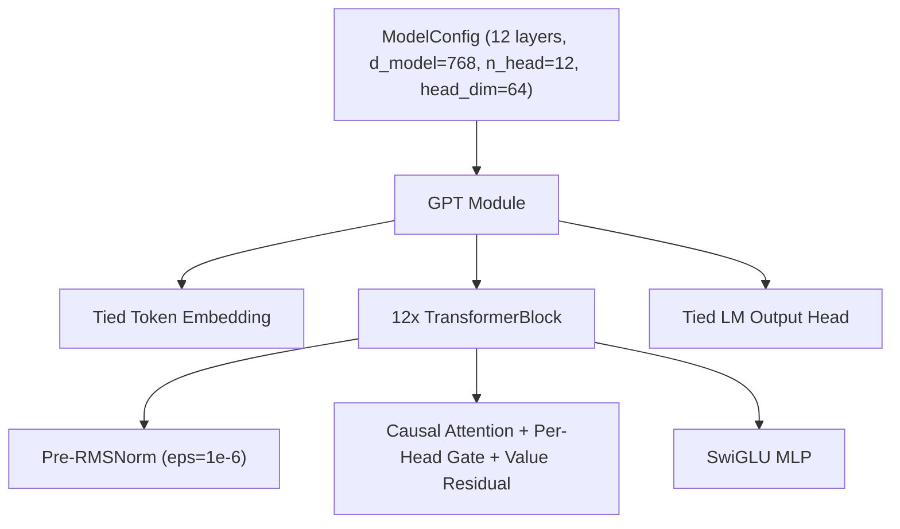

# ojas-nn

`ojas-nn` is the model assembly crate for full GPT architectures.

---

## Planned Architecture

*Note: Reference block operators are currently executed directly via [`ojas-cpu`](file:///Users/bharath/Code/research/ojas/ojas-cpu) and [`ojas-metal`](file:///Users/bharath/Code/research/ojas/ojas-metal).*
