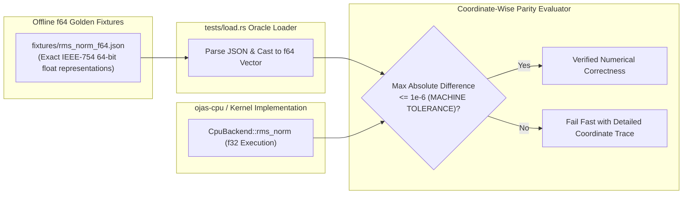

# ojas-oracle

`ojas-oracle` provides golden numerical fixtures generated offline in double precision (**IEEE-754 f64**) to verify the mathematical correctness of CPU and GPU kernel implementations without introducing runtime dependencies on Python or PyTorch.

---

## Verification Pipeline & Parity Testing

---

## Mathematical Specification (RMSNorm)

The reference RMSNorm fixture computes in IEEE-754 double precision:

$$\text{mean\_square} = \frac{1}{D} \sum_{i=1}^D x_i^2$$

$$y_i = x_i \cdot \frac{1}{\sqrt{\text{mean\_square} + 10^{-6}}} \cdot w_i$$

---

## Invariants & Defense Guarantees

> [!IMPORTANT]
> 1. **Zero Runtime Python Dependency:** By embedding exact double-precision golden fixtures directly into repository tests, `ojas` verifies mathematical soundness without requiring an active Python or PyTorch runtime in continuous integration environments.
> 2. **Canonical Machine Epsilon:** The normalization regularizer $\varepsilon = 10^{-6}$ (`RMS_NORM_EPS`) is verified directly against the fixture values.
> 3. **Non-Finite Detection:** The fixture parser rejects any non-finite float strings (`NaN`, `Infinity`) during test initialization.
