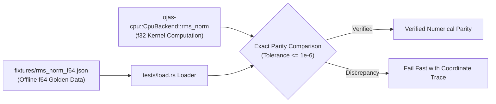

# ojas-oracle

`ojas-oracle` provides golden numerical fixtures generated offline in double precision (**IEEE-754 f64**) to verify the correctness of CPU and GPU kernel implementations without introducing runtime dependencies on Python or PyTorch.

---

## Verification Pipeline

---

## Existing Fixtures

* **RMSNorm (`fixtures/rms_norm_f64.json`):**
  Mathematical formula:
  $$\text{mean\_square} = \frac{1}{D} \sum_{i=1}^D x_i^2$$
  $$y = x \cdot \frac{1}{\sqrt{\text{mean\_square} + 10^{-6}}} \odot w$$
  Stored as exact IEEE-754 64-bit floating point representations for a row of length 4.
  Verified by `tests/load.rs::rms_norm_fixture_matches_cpu_reference`.
