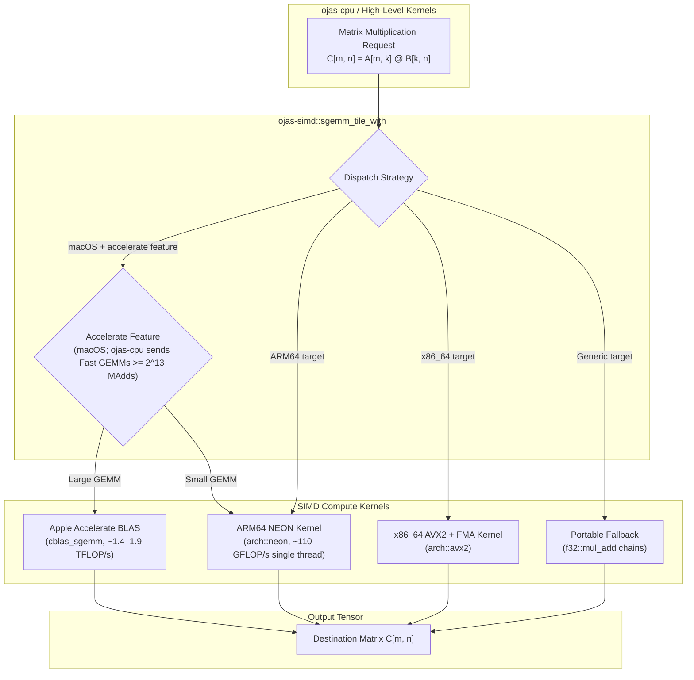
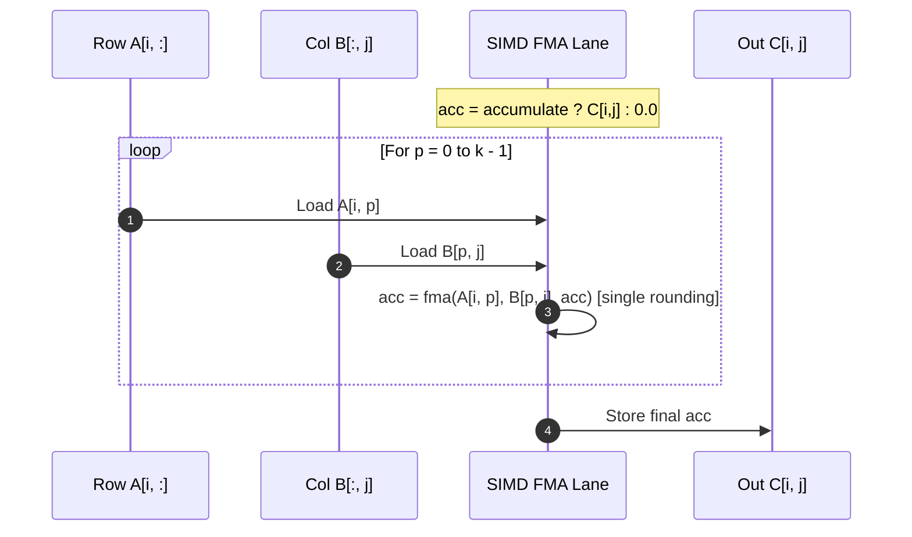

# ojas-simd

`ojas-simd` provides the **Fast-tier `f32` GEMM** (General Matrix Multiply) engine for `ojas`. It accelerates matrix operations using hardware SIMD vector extensions (ARM NEON, x86_64 AVX2+FMA) and optional hardware BLAS via Apple's Accelerate framework.

> [!NOTE]
> `ojas-cpu` represents the **Exact tier** (no FMA, strict ascending-$k$ additions for bit-identical reproducibility across diverse CPU microarchitectures). `ojas-simd` is the **Fast tier**, employing hardware FMA and SIMD vector lanes to maximize throughput.

---

## Architecture & SIMD Dispatch

---

## Determinism Contract (`sgemm_tile`, `sgemm_tile_with`)

Each output element in `sgemm_tile` evaluates an uninterrupted fused multiply-add (FMA) chain in strictly ascending inner-product index $p$:

$$\text{acc} = \begin{cases} C[i, j] & \text{if accumulate} \\ +0.0 & \text{otherwise} \end{cases}$$
$$\text{for } p = 0 \dots k-1: \quad \text{acc} = \text{fma}(A[i, p], B[p, j], \text{acc})$$
$$C[i, j] = \text{acc}$$

### Determinism Guarantees
* **Independent SIMD Chains:** Every SIMD lane executes an independent FMA chain without cross-lane reductions, guaranteeing that the bitwise result depends only on the corresponding row of $A$ and column of $B$.
* **Identical Results Across Tiling:** Splitting $C$ into arbitrary $M \times N$ tiles across worker threads yields bit-identical values to single-threaded sequential execution, provided the complete inner dimension $k$ is computed.
* **Cross-Architecture Equivalence:** The NEON, AVX2, and portable fallback implementations produce identical floating-point bit representations under test.

> [!WARNING]
> [`sgemm_accelerate`] delegates directly to Apple's proprietary Accelerate framework (`cblas_sgemm`). Because Accelerate utilizes dynamic multithreading heuristics and internal tree reductions, its results are **not bit-identical** across varying core counts or OS versions. Use `sgemm_tile` when bit-level determinism is required.

---

## Safety & Boundaries

> [!IMPORTANT]
> All dimension extents, leading dimensions, and buffer strides are validated using checked arithmetic before any low-level pointer access occurs. If any dimension is invalid or buffer memory is insufficient, execution halts immediately with [`SimdError`].
> 
> Unsafe operations are strictly isolated to the private `arch` submodule (`#![deny(unsafe_code)]` on the crate level).

### SimdError Taxonomy
* `DimensionZero`: Any matrix extent ($M$, $N$, or $K$) is 0.
* `BufferTooSmall`: Input or output slice length is insufficient for the requested matrix layout.
* `StrideTooSmall`: Leading dimension ($ld$) is smaller than the required extent.
* `IntegerOverflow`: Memory offset calculations overflow `usize`.

---

## Accelerate Vector Operations & vForce (macOS)

When compiled with the `accelerate` feature on macOS, `ojas-simd` exposes vectorized primitives beyond matrix multiplication:

- **vDSP Elementwise Kernels:** [`vdsp_vmul`], [`vdsp_vadd`], and their append forms call stride-1 Apple vDSP kernels for high-throughput single-precision vector math.
- **Row Movement:** [`vdsp_mmov`] and [`vdsp_mmov_append`] copy 2D matrix rows with bitwise preservation of sign bits, subnormals, and `-0.0`.
- **vForce Vector Math:** [`vvexpf`] and [`vvexpf_inplace`] dispatch to Apple Accelerate's vectorized exponential function (`y[i] = exp(x[i])`).
- **Sign & Negative Absolute:** [`store_neg_abs_signs`] processes data in chunked vector passes: it validates lane finiteness, records element signs (`z < 0`), and stores `-|z|` in a single pass.
- **NEON Embedding Gather:** [`gather_embedding_rows_768`] gathers 768-float embedding rows through ARM64 NEON pair loads/stores (`ldp`/`stnp`) into spare vector capacity with zero-copy preservation of subnormals and `-0.0`.
- **NEON Nanolab Head Pair Splitting:** [`split_nanolab_head_pairs_append`] loads 128 floats per token across adjacent heads, transposing 8×8 blocks in registers to unpack contiguous head blocks.
- **Token Band Partitioning:** [`with_nanolab_token_bands`] splits nanolab token batches across thread-safe time-row bands without allocation.
- **Edge Float Handling:** Preserves IEEE 754 invariants across vector operations, including subnormals, signed zeros, and non-finite value detection.

---

## Test Suites (40 tests under workspace)

- `tests/gemm.rs`: Multi-architecture GEMM determinism and cross-validation against references.
- `tests/embedding_gather.rs`: NEON embedding gather accuracy, duplicate IDs, and out-of-bounds refusals.
- `tests/vdsp.rs`: Apple vDSP vector addition, multiplication, and matrix row copy operations.
- `tests/vforce.rs`: Vectorized exponential accuracy and in-place transformations via vForce.
- `tests/neg_abs_signs.rs`: Vectorized negative-absolute transforms and boolean sign bit packing.
- `tests/reserved_f32.rs`: IEEE 754 edge-case compliance (subnormals, NaNs, infinities, signed zeros).
- `tests/accelerate.rs`: Integration with `cblas_sgemm` on Apple Silicon.
- `tests/errors.rs`: Checked shape validation and `SimdError` emission.
- `tests/fuzz.rs`: Random matrix dimension fuzzing.

---

## Performance Profile (Apple M5 Pro)

* **NEON SIMD:** ~110 GFLOP/s single-threaded throughput.
* **Apple Accelerate:** ~1.4–1.9 TFLOP/s on medium-to-large matrices ($256^3$, $512 \times 768 \times 768$, $2048^3$).
