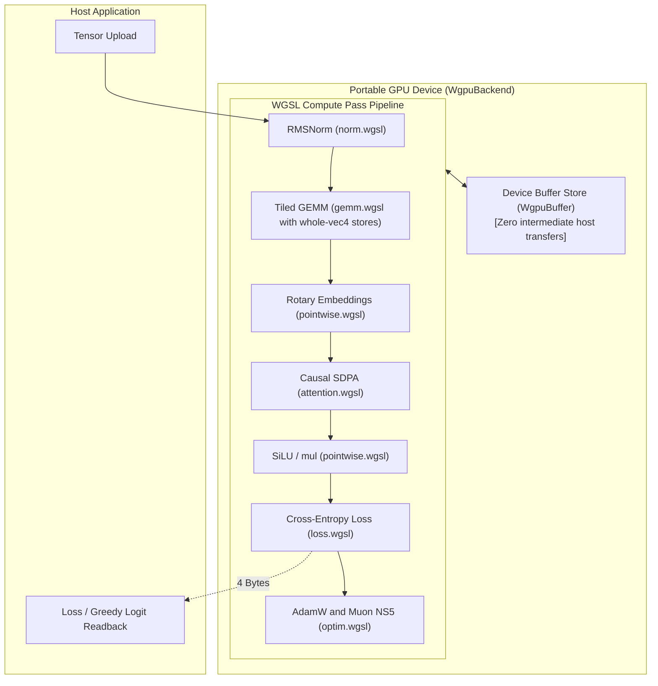
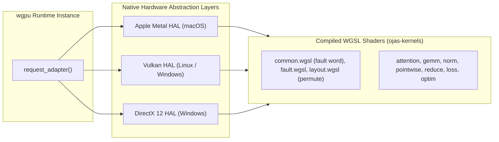

# ojas-wgpu

`ojas-wgpu` provides a **portable GPU compute backend** for `ojas`, executing deep learning workloads across diverse operating systems and graphics hardware using **WebGPU (WGSL)** via the `wgpu` runtime.

It implements full device-resident tensor operations (`WgpuBackend`), running natively on Vulkan (Linux/Windows), Metal (macOS), and DirectX 12.

---

## Compute Pipeline & Device Residency

---

## WGSL Kernel Distribution & Hardware Portability

---

## Numerical Tolerance & Backend Contract

> [!NOTE]
> * **Tolerance:** `WgpuBackend` operates in `Numerics::Fast` tier with a strict relative tolerance of **$10^{-4}$** against `ojas-cpu`.
> * **Muon NS5:** f32 Newton-Schulz on the device with the CPU reference's semantics (Nesterov momentum, Frobenius normalization, five steps on the wide orientation, `max(1, rows/cols)^0.5` scale, decoupled decay), reusing the WGSL GEMM. Parity against `ojas-cpu` is checked at 1e-4 of the largest reference value on square, wide and tall shapes including 768x768, 768x2304 and 2304x768 (`tests/muon.rs`).
> * **Permute:** `Backend::permute` moves `u32` words on the device, so the output bits equal the input bits. F32 only.
> * **Non-finite values are deferred:** an op that produces a non-finite value returns `Ok`; the next `sync`, `download` or `clip_grad_norm` returns `NonFinite` naming the first op, in recording order, that faulted. `adamw_step` and `muon_ns5_step` write nothing when their own values are non-finite. See the `backend` module docs.
> * **CPU adapters** (lavapipe, SwiftShader, WARP) are refused unless `OJAS_WGPU_ALLOW_CPU_ADAPTER=1`; Linux CI sets it to run the tests on lavapipe.

---

## Defensive Countermeasures & Safety Guarantees

> [!IMPORTANT]
> 1. **Whole-`vec4` Stores for Race Prevention:** A race condition in tiled WGSL matrix multiplication that occasionally zeroed output elements on specific GPU architectures was resolved by enforcing whole-`vec4` aligned store instructions.
> 2. **Explicit Device Failures:** If a compatible graphics adapter is missing or fails to initialize, `WgpuBackend::open` returns an explicit error (`OjasError::DeviceMismatch`) immediately—**never silently falling back to CPU execution**.
> 3. **Memory Overflow Protections:** Buffer allocations exceeding hardware device limits (`max_buffer_size`) return `OjasError::CapacityExceeded` before attempting GPU queue allocation.
> 4. **Zero-Readback Autograd:** The `wgpu_tape` autograd integration keeps all forward activations and backward adjoints on the device, downloading only the final scalar loss.
