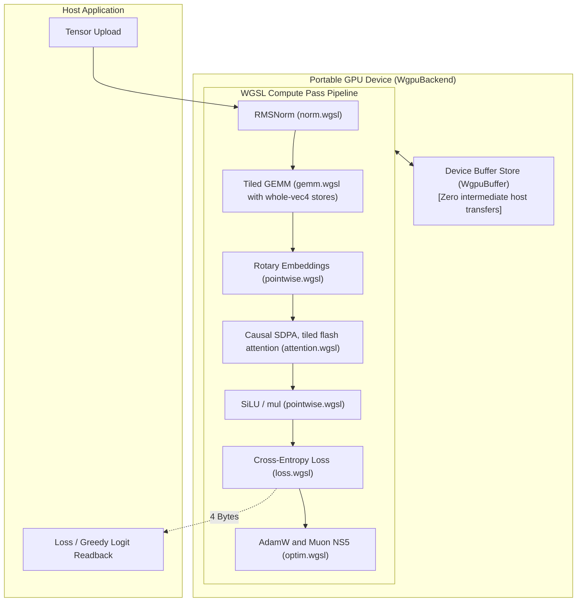
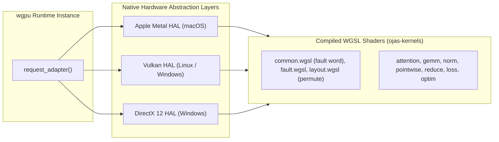

# ojas-wgpu

`ojas-wgpu` provides a **portable GPU compute backend** for `ojas`, executing deep learning workloads across diverse operating systems and graphics hardware using **WebGPU (WGSL)** via the `wgpu` runtime.

It implements full device-resident tensor operations (`WgpuBackend`), running natively on Vulkan (Linux/Windows), Metal (macOS), and DirectX 12.

---

## Compute Pipeline & Device Residency

---

## WGSL Kernel Distribution & Hardware Portability

---

## Numerical Tolerance & Backend Contract

> [!NOTE]
> * **Tolerance:** `WgpuBackend` operates in `Numerics::Fast` tier with a strict relative tolerance of **$10^{-4}$** against `ojas-cpu`.
> * **Muon NS5:** f32 Newton-Schulz on the device with the CPU reference's semantics (Nesterov momentum, Frobenius normalization, five steps on the wide orientation, `max(1, rows/cols)^0.5` scale, decoupled decay), reusing the WGSL GEMM. Parity against `ojas-cpu` is checked at 1e-4 of the largest reference value on square, wide and tall shapes including 768x768, 768x2304 and 2304x768 (`tests/muon.rs`).
> * **Permute:** `Backend::permute` moves `u32` words on the device, so the output bits equal the input bits. F32 only.
> * **Non-finite values are deferred:** an op that produces a non-finite value returns `Ok`; the next `sync`, `download` or `clip_grad_norm` returns `NonFinite` naming the first op, in recording order, that faulted. `sync` is the `Backend::sync` override, so a caller holding `&dyn Backend`, `impl Backend` or `Arc<WgpuBackend>` sees the fault too; a lost device makes it return `Backend` naming the loss. `adamw_step` and `muon_ns5_step` write nothing when their own values are non-finite. See the `backend` module docs.
> * **Causal SDPA:** tiled flash attention for head widths up to 256 (padded to 16/32/64/128/256). The forward keeps an online softmax per row; the backward recomputes the probabilities in tiles, in a dQ pass and a dK/dV pass, with no `T x T` matrix and no atomics, so repeated runs give the same bits (`tests/attention.rs`). Grouped-query heads are expanded into that equal-head kernel and the KV gradients are summed back.
> * **RMSNorm:** a row is reduced by `next_pow2(min(D, 256))` lanes, so a 256-lane workgroup holds `256 / width` rows (four rows of D = 64). The segmented tree sum pairs lanes as the full 256-lane tree does, so the bits do not depend on the packing. `rms_qk_norm_forward` / `_backward` record q and k in one submission and give the bits, refusals and fault names of two `rms_norm` calls; a refused k still records q first, as the composition would (`tests/norm.rs`).
> * **No subgroups:** the kernels use shared memory and barriers only. A subgroup-shuffle row exchange for SDPA was measured at 0.98-1.02x and removed, and dropping the tree reductions' sub-32 barriers outright moved RMSNorm and cross-entropy by no more than the noise.
> * **Shape first:** every op calls its `ojas_core::shapes` validator before placement, id and target ranges, optimizer scalars, device limits or any budget charge, so a malformed call returns the validator's exact error whatever the budget, values or placement (docs/shape-contract.md). `clip_grad_norm` checks `max_norm` after the norm, as the CPU does. `tests/shape_first.rs` sweeps every op under `Budget::new(0)`, an inputs-only cap, a NaN operand and host operands.
> * **Bounded drop:** wgpu's `Queue` drop waits for the queue to go idle with no timeout. Dropping the last handle on a context (the backend and every tensor) waits at most `DROP_WAIT` (2 s) for that; past it, a background thread finishes the drop, and until the GPU is done the queue, the device and their memory stay alive (`tests/drop.rs`).
> * **Threads:** `WgpuBackend` is `Send + Sync`; threads sharing one backend get the bits a serial run gives, and a device lost mid-flight fails every thread with an error (`tests/stress.rs`).
> * **Training and decode ops (T2-T5):** `accumulate_grad` adds in the accumulator's own buffer when it is the sole owner (a shared one gets a new buffer); `linear_cross_entropy_mean` keeps at most `chunk.rows x chunk.cols` logits alive, folds vocabulary tiles into an online softmax, and accumulates both gradients through the GEMM (`tests/linear_ce.rs`); `cached_attention_forward` splits the keys of a time-major cache so one decode query still fills the GPU, with grouped-query heads and rows that never read past their own position; `kv_cache_write` refuses before recording anything and copies only if the source is finite, so the cache is unchanged on every error (`tests/kv_cache.rs`). Non-finite values in these ops are reported at the next sync point, as for every op.
> * **CPU adapters** (lavapipe, SwiftShader, WARP) are refused unless `OJAS_WGPU_ALLOW_CPU_ADAPTER=1`; Linux CI sets it to run the tests on lavapipe.

---

## Defensive Countermeasures & Safety Guarantees

> [!IMPORTANT]
> 1. **Whole-`vec4` Stores for Race Prevention:** A race condition in tiled WGSL matrix multiplication that occasionally zeroed output elements on specific GPU architectures was resolved by enforcing whole-`vec4` aligned store instructions.
> 2. **Explicit Device Failures:** If a compatible graphics adapter is missing or fails to initialize, `WgpuBackend::open` returns an explicit error (`OjasError::DeviceMismatch`) immediately—**never silently falling back to CPU execution**.
> 3. **Memory Overflow Protections:** Buffer allocations exceeding hardware device limits (`max_buffer_size`) return `OjasError::CapacityExceeded` before attempting GPU queue allocation.
> 4. **Zero-Readback Autograd:** The `wgpu_tape` autograd integration keeps all forward activations and backward adjoints on the device, downloading only the final scalar loss.

---

## Test Suites (208 tests)

- `tests/accumulate_grad.rs`: In-place vs buffered gradient accumulation and bit-matching against CPU.
- `tests/attention.rs`: Tiled causal attention forward/backward, long sequences, and head dimensions up to 256.
- `tests/contract.rs`: Backend trait implementation contracts and deferred fault reporting.
- `tests/drop.rs`: Bounded timeout on queue and buffer cleanup.
- `tests/faults.rs`: Non-finite deferred fault recording order and naming.
- `tests/gemm.rs`: Tiled WGSL GEMM determinism and nanolab projection shapes.
- `tests/kv_cache.rs`: Grouped-query cached attention and boundary slice writes.
- `tests/linear_ce.rs`: Tiled linear cross-entropy online softmax and memory bounds.
- `tests/muon.rs`: 5-step Newton-Schulz optimizer execution on device tensors.
- `tests/norm.rs`: RMSNorm, QK-norm reductions, and workgroup segment packing.
- `tests/parity.rs`: Full-breadth numerical parity against CPU reference operations.
- `tests/permute.rs`: Rank-4 layout transformations and dimension reordering.
- `tests/residency.rs`: End-to-end device activation residency during training loops.
- `tests/shape_first.rs`: Shape validator enforcement across zero-capacity budgets and NaN inputs.
- `tests/stress.rs`: Multi-threaded concurrency, device loss handling, and Send+Sync safety.
