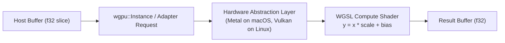

# ojas-wgpu

`ojas-wgpu` implements portable compute shaders using **WebGPU (WGSL)** via the `wgpu` runtime.

---

## Compute Pipeline



---

## Verification & Device Details

On this machine (Apple M5 Pro):
```
ojas-wgpu adapter: Apple M5 Pro vendor=Apple (wgpu vendor field 0) hal=Metal
```

* **NaN Propagation:** Passing `f32::NAN` through affine scaling properly produces NaNs without pipeline stalling.
* **Empty Buffer Safety:** Zero-length input buffers return `Ok` with `dispatched == false` without allocating compute passes.
* **Size Validation:** Buffers exceeding `u32::MAX` return `DeviceError::NoDevice`.
